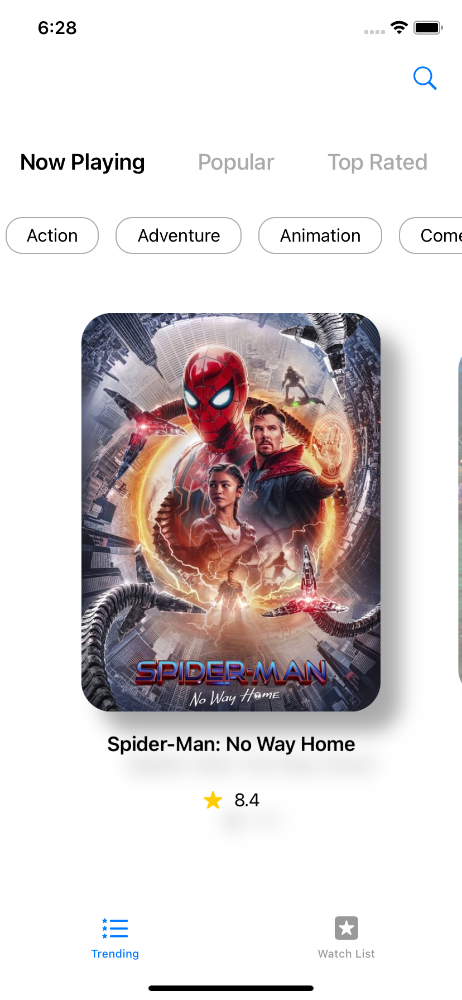
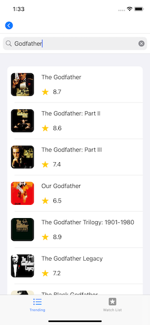

# Projector
Projector is an iOS mobile app that enables to get all information about movies, based on The Movie Database (TMDb) 

## Third-party libraries

 - [SD Web Image](https://github.com/SDWebImage/SDWebImage)
 - [Alamofire](https://github.com/Alamofire/Alamofire)
 - [AnimatedCollectionViewLayout](https://github.com/KelvinJin/AnimatedCollectionViewLayout)
 
 ## Architecture
 - MVVM
 
 ## Screenshots
 

 

 

